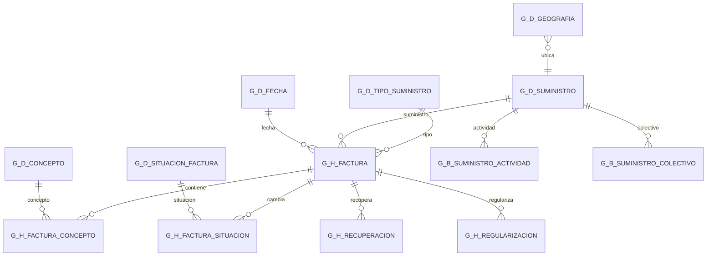

# Diseño Gold de Agua Clara

## Granos

- `g_h_factura`: una factura y partición.
- `g_h_factura_concepto`: un componente económico de factura y partición.
- `g_h_factura_situacion`: una transición de situación por factura, partición y momento.
- `g_h_recuperacion`: una recuperación por factura y partición artificial `1`.
- `g_h_regularizacion`: una regularización por factura, partición artificial `1` y fecha de incidencia.

## Dimensiones

- `g_d_fecha`: fechas de negocio existentes en Silver.
- `g_d_suministro`: versión más reciente del suministro; contiene atributos de cliente para filtrado sin dimensión cliente.
- `g_d_geografia`: ubicación canónica por suministro. Una ubicación por suministro evita multiplicar hechos; las relaciones originales siguen disponibles en Silver EDW.
- `g_d_tipo_suministro`: catálogo TSS.
- `g_d_concepto`: conceptos F25 y componentes derivados de agua con prefijos que evitan colisiones.
- `g_d_situacion_factura`: catálogo R01.
- `g_b_suministro_actividad`: puente multivaluado de epígrafes IAE.
- `g_b_suministro_colectivo`: puente temporal de colectivos sociales.

No se crean dimensiones de cliente ni tarifa. `edw_h_tarifa_facturacio` es auxiliar y no está relacionado con la tarifa de factura.

## Reglas temporales

Una factura es vulnerable cuando `DATA_FIN_FACT` está dentro del intervalo social `DATA_INI_IND` a `DATA_FIN_IND`. Un suministro se considera fraudulento desde `DATA_CREA_C_FRA` mientras exista el convenio asociado.

La sección `I` de IAE identifica la actividad industrial principal. La sección `S` se conserva como actividad secundaria y no la sustituye.

## Auditoría

Todos los hechos conservan `FECHA_EXTRACCION` y `SISTEMA_ORIGEN` heredados. `FECHA_CARGA` se calcula en Gold con zona horaria `Europe/Madrid`. `TABLA_ORIGEN` identifica el modelo Silver de procedencia.

## Medidas Power BI

- Importe total de factura: sumar `g_h_factura.IMP_TOTAL_FACT` a grano de factura.
- Importe agua IVA: sumar `g_h_factura.IMP_AIGUA_IVA` a grano de factura.
- Importe de conceptos: sumar `g_h_factura_concepto.IMP_CONCEPTE`.
- Consumo total: sumar `g_h_factura.CONSUM_TOTAL_M3` o los bloques de concepto, nunca ambas fuentes simultáneamente.
- Recuperaciones: sumar `g_h_recuperacion.IMP_TOTAL_RECUPERACION` y `M3_TOTAL_RECUPERADOS`.
- Regularizaciones: sumar `g_h_regularizacion.IMP_TOTAL_REGULARIZACION` y `M3_TOTAL_REGULARIZADOS`.

No se deben relacionar hechos entre sí ni sumar medidas de cabecera después de expandirlas con líneas de concepto.

## Diagrama

