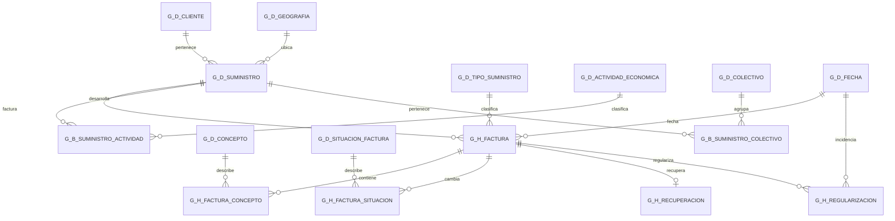

# Diseño de la capa Gold Fact de Agua Clara

## 1. Objetivo

La capa `gold_fact` presenta un modelo dimensional orientado a Power BI a partir de `silver_fact` y `silver_edw`. Su finalidad es ofrecer dimensiones conformadas, hechos con granularidad explícita, medidas auditables y relaciones estables, evitando que los consumidores tengan que reconstruir reglas de negocio desde las capas Silver.

Todos los modelos se materializan como `table` para priorizar la corrección y la reproducibilidad del piloto frente a una incrementalidad prematura.

## 2. Convenciones generales

### 2.1 Clave natural de factura

La clave natural de factura se expresa siempre, y en este orden, mediante:

```text
NUM_PARTICIO, ID_EMPRESA, ANY_FACTURA, NUM_FACTURA
```

Las regularizaciones añaden al final `DATA_FIN_PER_INCID`. Las situaciones añaden `MOM_INI_SITUACION`.

### 2.2 Miembros desconocidos

Las dimensiones incorporan miembros desconocidos con claves técnicas deterministas. Las tablas de hechos emplean dichas claves cuando la dimensión correspondiente no puede resolverse, evitando claves foráneas nulas y preservando la integridad referencial.

### 2.3 Auditoría

Los modelos Gold mantienen los campos de auditoría de las capas anteriores:

- `ID_CARGA`: heredado de la fuente inmediata.
- `FECHA_EXTRACCION`: heredada de la fuente inmediata.
- `FECHA_CARGA`: calculada durante la materialización Gold con la fecha del sistema y la zona horaria `Europe/Madrid`.
- `SISTEMA_ORIGEN`: heredado de la fuente inmediata.
- `TABLA_ORIGEN`: identifica la tabla Silver o EDW Silver principal que origina el registro Gold.

En filas técnicas generadas directamente en Gold, como miembros desconocidos o fechas de calendario, los valores de auditoría se informan con constantes técnicas controladas.

### 2.4 Procedencia funcional de conceptos

En `g_h_factura_concepto`, `TABLA_ORIGEN` identifica la fuente inmediata Gold (`S_FACTURA_CONCEPTO`), mientras `ORIGEN_CONCEPTO` conserva la procedencia funcional original:

- `L4_FACT_AIGUA`: componentes económicos derivados de agua.
- `L4_FACT_CONCEPTE`: conceptos explícitos adicionales.

## 3. Inventario y granularidad

### 3.1 Dimensiones

- `g_d_fecha`: una fila por fecha.
- `g_d_cliente`: una fila por cliente.
- `g_d_geografia`: una fila por finca.
- `g_d_suministro`: una fila por suministro.
- `g_d_tipo_suministro`: una fila por tipo de suministro.
- `g_d_situacion_factura`: una fila por situacion de factura.
- `g_d_actividad_economica`: una fila por actividad economica.
- `g_d_colectivo`: una fila por colectivo social.
- `g_d_concepto`: una fila por concepto conformado.

### 3.2 Bridges

- `g_b_suministro_actividad`: una fila por suministro y actividad economica.
- `g_b_suministro_colectivo`: una fila por suministro y episodio historico de colectivo.

### 3.3 Hechos

- `g_h_factura`: una fila por particion, empresa, anyo y numero de factura.
- `g_h_factura_concepto`: una fila por componente economico normalizado de factura.
- `g_h_factura_situacion`: una fila por factura y momento inicial de situacion.
- `g_h_recuperacion`: una fila por particion, empresa, anyo y numero de factura.
- `g_h_regularizacion`: una fila por factura y fecha final del periodo de incidencia.

## 4. Dimensiones

### 4.1 `g_d_fecha`: Calendario conformado

Calendario continuo desde el 1 de enero de 2020 hasta el 31 de diciembre de 2026. Incluye atributos de año, mes, trimestre, semana ISO, día del año, inicio y fin de mes y trimestre. `ES_LABORABLE` es una simplificación del piloto: verdadero cuando la fecha no cae en fin de semana, sin considerar festivos.

Claves únicas documentadas: `FECHA`.

### 4.2 `g_d_cliente`: Cliente

Una fila por `DNI_NIF_CLIENT`, más un miembro desconocido. Contiene los datos básicos identificativos del cliente disponibles para el suministro facturado (DNI_NIF_CLIENT, NOM_CLIENT, NOM_COMERCIAL). `DNI_NIF_CLIENT` y los nombres son datos sensibles que deben protegerse en las vistas de consumo.

Claves únicas documentadas: `HK_CLIENTE`, `DNI_NIF_CLIENT`.

### 4.3 `g_d_geografia`: Geografía

Una fila por finca. `HK_GEOGRAFIA` coincide con `HK_FINCA` para ubicaciones conocidas y reúne finca, calle, municipio y distrito municipal. El suministro incorpora esta clave como referencia dimensional.

Claves únicas documentadas: `HK_GEOGRAFIA`.

### 4.4 `g_d_suministro`: Suministro

Una fila por suministro con la última versión disponible. Conserva atributos actuales, además de `HK_CLIENTE` y `HK_GEOGRAFIA`. Los atributos históricos congelados en la fecha de factura permanecen en `g_h_factura`.

Claves únicas documentadas: `HK_SUBMIN_SERVEI`, `POLISSA_SUBM`.

### 4.5 `g_d_tipo_suministro`: Tipo de suministro

Catálogo de tipos de suministro con descripciones reutilizables. Se relaciona con el tipo congelado en factura para que Power BI filtre por la clasificación vigente al emitir la factura.

Claves únicas documentadas: `HK_TIPO_SUMINISTRO`, `COD_TIPO_SUMINISTRO`.

### 4.6 `g_d_situacion_factura`: Situación de factura

Catálogo de situaciones procedente de Silver Fact. Describe los eventos de `g_h_factura_situacion`.

Claves únicas documentadas: `HK_SITUACION_FACT`, `TIP_SIT_FACT`.

### 4.7 `g_d_actividad_economica`: Actividad económica

Una fila por epígrafe IAE, con descripción, tipo de tarifa, cuota TAMGREM y clasificación de residuos. La relación con suministro es multivaluada y se resuelve mediante un bridge.

Claves únicas documentadas: `HK_ACTIVIDAD_ECONOMICA`.

### 4.8 `g_d_colectivo`: Colectivo social

Una fila por tipo de colectivo social. Los periodos de pertenencia se conservan en el bridge temporal de suministro y colectivo.

Claves únicas documentadas: `HK_COLECTIVO`, `TIP_COLECTIVO`.

### 4.9 `g_d_concepto`: Concepto facturable

Unifica componentes de agua y conceptos explícitos. Los primeros utilizan el prefijo `AIGUA:` y los segundos `CONCEPTE:`. La seed `g_s_concepto_clasificacion` aporta la clasificación funcional y los indicadores semánticos.

Claves únicas documentadas: `CODIGO_CONCEPTO`.

## 5. Bridges

### 5.1 `g_b_suministro_actividad`

Representa la relación multivaluada entre suministros y actividades económicas. Su clave única es la combinación `HK_SUBMIN_SERVEI`, `HK_ACTIVIDAD_ECONOMICA`. Conserva los indicadores de actividad industrial principal y actividad secundaria de servicios.

### 5.2 `g_b_suministro_colectivo`

Representa la relación temporal entre suministro y colectivo social. Su clave única es la combinación `HK_SUBMIN_SERVEI`, `HK_HIST_SS_PE`. Conserva inicio, fin y observaciones del episodio social. Estos bridges no se exponen inicialmente en el dataset principal de Power BI para evitar ambigüedades de filtrado.

## 6. Hechos

### 6.1 `g_h_factura`

Hecho de cabecera de factura. Una fila por clave natural completa. Contiene `CONSUM_TOTAL_M3`, `IMP_AIGUA_IVA`, `IMP_TOTAL_FACT`, el tipo de suministro congelado y los indicadores de recuperación, regularización, actividad industrial, vulnerabilidad y fraude.

Diferencia el recuento de líneas en:

- `NUM_CONCEPTOS_TOTAL`.
- `NUM_CONCEPTOS_AGUA`.
- `NUM_CONCEPTOS_EXPLICITOS`.

Los indicadores `TIENE_RECUPERACION` y `TIENE_REGULARIZACION` se calculan mediante comprobación explícita del valor `S` y se validan contra la existencia real de hechos relacionados.

### 6.2 `g_h_factura_concepto`

Hecho de líneas económicas normalizadas. Cada fila contiene factura, suministro, concepto conformado, cantidad, base, precio, porcentaje, importe e IVA. `IMP_CONCEPTE` es la medida monetaria aditiva principal.

La clave de concepto se genera explícitamente:

```text
L4_FACT_AIGUA    -> AIGUA:<TIPUS_CONCEPTE>
L4_FACT_CONCEPTE -> CONCEPTE:<NUM_CONCEPTE>
```

### 6.3 `g_h_factura_situacion`

Hecho histórico de cambios de situación. Almacena el momento inicial y final, orden, indicador de situación actual, código, descripción y causa. Permite reconstruir la secuencia temporal de cada factura.

### 6.4 `g_h_recuperacion`

Hecho de recuperaciones con una fila por factura y partición. Mantiene volumen total, importe total y los componentes monetarios recuperados de agua, cuota, alcantarillado, saneamiento, residuos, infraestructura hidráulica, bonificaciones y canon.

### 6.5 `g_h_regularizacion`

Hecho de regularizaciones con una fila por factura, partición y fecha final del periodo de incidencia. Mantiene volumen total, importe total y los componentes regularizados de bloques, cuotas, cánones, alcantarillado, saneamiento, residuos e infraestructura hidráulica.

## 7. Clasificación de conceptos

La seed `g_s_concepto_clasificacion` centraliza la semántica de los conceptos mediante `GRUPO_FUNCIONAL`, `ES_CONSUMO`, `ES_SERVICIO`, `ES_TRIBUTO`, `ES_BONIFICACION`, `ES_IVA` y `ES_ADITIVO`. El test `gold_fact_conceptos_sin_clasificar.sql` obliga a clasificar cualquier concepto nuevo.

Clasificaciones principales:

- `AIGUA_BLOC1..5`: `CONSUMO_AGUA`.
- `QUOTA_SERVEI` y `CT_XBASICA`: `CUOTA_SERVICIO`.
- `TCG_SUBM`: `OTROS_SERVICIOS`.
- `CLAVEGUERAM`: `ALCANTARILLADO`.
- `SANEJAMENT`: `SANEAMIENTO`.
- `ERSU` y `TAM`: `RESIDUOS`.
- `CIH_BLOC1..3`: `INFRAESTRUCTURA_HIDRAULICA`.
- `CA1`, `CA2`, `CA3`, `CA4`, `CA6`, `CA7`: `CANON_AGUA`.
- `CON`: `CONSERVACION`.
- `BSA`, `BSQ`: `BONIFICACION`.
- `B25`, `B45`, `B70`, `SPR`: `EQUIPO_CI`.
- `CA5`, `IVN`, `IVA`, `IVA_SANEJAMENT`: `IVA`.

## 8. Reglas de negocio y reconciliación

### 8.1 Cuadre de factura

```text
g_h_factura.IMP_AIGUA_IVA
= SUM(g_h_factura_concepto.IMP_CONCEPTE)
  para ORIGEN_CONCEPTO = 'L4_FACT_AIGUA'
```

```text
g_h_factura.IMP_TOTAL_FACT
= SUM(g_h_factura_concepto.IMP_CONCEPTE)
  para conceptos con ES_ADITIVO = true
```

```text
g_h_factura.CONSUM_TOTAL_M3
= SUM(g_h_factura_concepto.QUANTITAT)
  para AIGUA_BLOC1..5
```

Tolerancias: 0,01 para importes y 0,000001 para volúmenes.

### 8.2 Contra incendios

Las facturas con `TIP_SUBM_SERV_FACTURA = C` no deben contener líneas cuya procedencia funcional sea `L4_FACT_AIGUA`. Sus importes se representan mediante conceptos explícitos de equipos CI.

### 8.3 Vulnerabilidad y fraude

Una factura es vulnerable cuando `DATA_FIN_FACT` cae dentro del intervalo `DATA_INI_IND` a `DATA_FIN_IND`. Un suministro se considera fraudulento desde `DATA_CREA_C_FRA` mientras permanezca en la tabla de convenios; las facturas anteriores no se marcan como fraudulentas.

## 9. Uso en Power BI

- Una única `g_d_fecha` soporta todas las fechas. El equipo de Power BI decidirá qué relación mantener activa y cuándo usar relaciones inactivas o roles de fecha.
- No deben relacionarse hechos entre sí en el modelo semántico. Las dimensiones deben filtrar cada hecho de forma unidireccional.
- No deben sumarse medidas de cabecera después de expandir una factura con sus conceptos.
- `IMP_TOTAL_FACT` e `IMP_AIGUA_IVA` se agregan desde `g_h_factura`.
- `IMP_CONCEPTE` se agrega desde `g_h_factura_concepto`.
- `CONSUM_TOTAL_M3` o las cantidades por bloque pueden utilizarse como fuente de consumo, pero no deben sumarse simultáneamente.
- Recuperaciones y regularizaciones se agregan desde sus hechos específicos.
- Los bridges se mantienen fuera de la exposición inicial. Power BI se alimentará mediante vistas materializadas adaptadas a perspectivas bruta, actual y a fin de mes.

## 10. Calidad y tests

La capa dispone de controles para:

- claves únicas y no nulas;
- relaciones dimensionales;
- combinación única de claves naturales;
- conceptos sin clasificación;
- reconciliación Silver a Gold;
- cuadre interno de agua, consumo y total;
- facturas CI sin componentes de agua;
- coherencia entre indicadores y existencia de recuperación o regularización;
- reconciliación detallada de recuperaciones y regularizaciones;
- herencia de campos de auditoría.

## 11. Diagrama lógico


```mermaid
erDiagram
    G_D_CLIENTE ||--o{ G_D_SUMINISTRO : pertenece
    G_D_GEOGRAFIA ||--o{ G_D_SUMINISTRO : ubica
    G_D_SUMINISTRO ||--o{ G_H_FACTURA : factura
    G_D_TIPO_SUMINISTRO ||--o{ G_H_FACTURA : clasifica
    G_D_CONCEPTO ||--o{ G_H_FACTURA_CONCEPTO : describe
    G_D_SITUACION_FACTURA ||--o{ G_H_FACTURA_SITUACION : describe
    G_D_ACTIVIDAD_ECONOMICA ||--o{ G_B_SUMINISTRO_ACTIVIDAD : clasifica
    G_D_SUMINISTRO ||--o{ G_B_SUMINISTRO_ACTIVIDAD : desarrolla
    G_D_COLECTIVO ||--o{ G_B_SUMINISTRO_COLECTIVO : agrupa
    G_D_SUMINISTRO ||--o{ G_B_SUMINISTRO_COLECTIVO : pertenece
    G_D_FECHA ||--o{ G_H_FACTURA : fecha
    G_D_FECHA ||--o{ G_H_REGULARIZACION : incidencia
    G_H_FACTURA ||--o{ G_H_FACTURA_CONCEPTO : contiene
    G_H_FACTURA ||--o{ G_H_FACTURA_SITUACION : cambia
    G_H_FACTURA ||--o| G_H_RECUPERACION : recupera
    G_H_FACTURA ||--o{ G_H_REGULARIZACION : regulariza
```

## 12. Diccionario resumido por modelo

El detalle completo de tipos, descripciones, tests y metadatos se mantiene en `schema.yml`. A continuación se recogen las columnas funcionales de cada modelo, excluyendo los cinco campos comunes de auditoría.

### `g_d_fecha`

- `FECHA` (`date`): Fecha de calendario y clave natural de la dimensión.
- `ANYO` (`number(4,0)`): Año natural de la fecha.
- `MES` (`number(2,0)`): Número de mes natural entre 1 y 12.
- `MES_NUMERO` (`varchar(2)`): Número de mes con dos posiciones, útil para ordenación y presentación.
- `NOMBRE_MES` (`varchar`): Nombre abreviado del mes devuelto por Snowflake.
- `ANYO_MES` (`varchar(6)`): Clave cronológica año-mes con formato YYYYMM, apta para ordenar periodos mensuales.
- `MES_ANYO` (`varchar(7)`): Etiqueta mensual con formato MM/YYYY para visualización.
- `TRIMESTRE` (`number(1,0)`): Trimestre natural entre 1 y 4.
- `DIA` (`number(2,0)`): Día del mes.
- `DIA_SEMANA` (`number(1,0)`): Número ISO del día de la semana: 1 lunes y 7 domingo.
- `NOMBRE_DIA` (`varchar`): Nombre abreviado del día de la semana.
- `SEMANA_ISO` (`number(2,0)`): Número de semana según calendario ISO.
- `ANYO_SEMANA` (`varchar(6)`): Clave año-semana ISO con formato YYYYWw sin separador.
- `DIA_ANYO` (`number(3,0)`): Número ordinal del día dentro del año.
- `ES_FIN_SEMANA` (`boolean`): Indicador de sábado o domingo.
- `ES_LABORABLE` (`boolean`): Indicador simplificado de día laborable para el piloto. Es verdadero cuando ES_FIN_SEMANA es falso; no contempla festivos.
- `INICIO_MES` (`date`): Primer día del mes de FECHA.
- `FIN_MES` (`date`): Último día del mes de FECHA.
- `INICIO_TRIMESTRE` (`date`): Primer día del trimestre de FECHA.
- `FIN_TRIMESTRE` (`date`): Último día del trimestre de FECHA.

### `g_d_cliente`

- `HK_CLIENTE` (`string`): Clave técnica estable del cliente calculada a partir de DNI_NIF_CLIENT. El miembro desconocido utiliza una hash determinista específica.
- `DNI_NIF_CLIENT` (`varchar(9)`): Documento fiscal del cliente. Actúa como clave natural; contiene información sensible y debe protegerse en las vistas de consumo.
- `NOM_CLIENT` (`varchar(35)`): Nombre del cliente observado en la factura más reciente seleccionada para la dimensión. Contiene información personal.
- `NOM_TITULAR` (`varchar(35)`): Nombre normalizado del titular utilizado para análisis de cliente.
- `NOM_COMERCIAL` (`varchar(50)`): Nombre comercial del cliente cuando está disponible en la fuente.

### `g_d_geografia`

- `HK_GEOGRAFIA` (`string`): Clave técnica de la geografía. Para ubicaciones conocidas coincide con HK_FINCA; el miembro desconocido utiliza una hash determinista.
- `HK_FINCA` (`string`): Clave hash de la finca que determina el grano geográfico.
- `HK_CARRER` (`string`): Clave hash de la calle asociada a la finca.
- `HK_MUNICIPI_SGAB` (`string`): Clave hash del municipio SGAB asociado a la calle.
- `NUM_MUN_SGAB` (`varchar(2)`): Código interno SGAB del municipio.
- `NOM_MUN_SGAB` (`varchar(20)`): Nombre del municipio SGAB.
- `NUM_CARRER` (`number(6,0)`): Número interno de la calle dentro del municipio.
- `NOM_COMPLET_CARRER` (`varchar(44)`): Nombre completo normalizado de la calle.
- `NUM_INI_FINCA` (`varchar(4)`): Número inicial del rango postal que identifica la finca.
- `COMP_NUM_INI_FINCA` (`varchar(1)`): Complemento del número inicial de finca.
- `NUM_FIN_FINCA` (`varchar(4)`): Número final del rango postal de la finca.
- `COMP_NUM_FIN_FINCA` (`varchar(1)`): Complemento del número final de finca.
- `NUM_DTE_MUNI_FINCA` (`varchar(2)`): Código del distrito municipal asociado a la finca.

### `g_d_suministro`

- `HK_SUBMIN_SERVEI` (`string`): Clave hash del suministro, calculada en Silver EDW a partir de POLISSA_SUBM.
- `POLISSA_SUBM` (`varchar(10)`): Identificador natural de la póliza de suministro.
- `HK_CLIENTE` (`string`): Clave foránea del cliente asociado actualmente al suministro.
- `HK_GEOGRAFIA` (`string`): Clave foránea de la finca o ubicación geográfica asociada al suministro mediante suministro, ramal y finca.
- `TIP_SUBM_SERV` (`varchar(1)`): Tipo actual del suministro: D doméstico, I industrial o C contra incendios.
- `SIT_SUBM_SERV` (`varchar(1)`): Situación operativa actual del suministro.
- `US_AIGUA_SUBM` (`varchar(1)`): Código actual de uso del agua del suministro.
- `TIP_HABIT_SUBM` (`varchar(1)`): Tipo actual de vivienda asociado al suministro.
- `NOMB_HABIT_SUBM` (`number(3,0)`): Número actual de habitantes asociado al suministro.
- `DNI_NIF_CLIENT` (`varchar(9)`): Documento fiscal del cliente asociado al suministro. Se conserva para trazabilidad; contiene información sensible.
- `ID_QUOTA_SOCIAL` (`varchar(1)`): Indicador actual de cuota social.
- `ID_TARIFA_SOCIAL` (`varchar(1)`): Indicador actual de tarifa social.
- `IND_SERVEI_SOCIAL` (`varchar(1)`): Indicador actual de intervención o reconocimiento por servicios sociales.
- `IND_POB_ENERG` (`varchar(1)`): Indicador actual de pobreza energética.

### `g_d_tipo_suministro`

- `HK_TIPO_SUMINISTRO` (`string`): Clave hash del tipo de suministro.
- `COD_TIPO_SUMINISTRO` (`varchar`): Código funcional del tipo de suministro.
- `DES_TIPO_SUMINISTRO` (`varchar`): Descripción completa del tipo de suministro.
- `DES_ABREV_TIPO_SUMINISTRO` (`varchar`): Descripción abreviada del tipo de suministro.

### `g_d_situacion_factura`

- `HK_SITUACION_FACT` (`string`): Clave hash de la situación de factura.
- `TIP_SIT_FACT` (`varchar(2)`): Código funcional de la situación de factura.
- `DESC_SITUACION` (`varchar`): Descripción completa de la situación.
- `DESC_BREU_SITUACION` (`varchar`): Descripción breve de la situación.

### `g_d_actividad_economica`

- `HK_ACTIVIDAD_ECONOMICA` (`string`): Clave técnica Gold de la actividad económica; para registros conocidos coincide con HK_EPIGRAF_IAE.
- `HK_EPIGRAF_IAE` (`string`): Clave hash del epígrafe IAE de Silver EDW.
- `SECCIO` (`varchar(1)`): Sección que agrupa el epígrafe IAE.
- `EPIGRAF_IAE` (`varchar(4)`): Código del epígrafe IAE.
- `DESCR_IAE` (`varchar(50)`): Descripción de la actividad económica.
- `TIP_TARIFA` (`varchar(1)`): Código de tipo de tarifa asociado a la actividad.
- `TIP_QUOTA_TAMGREM` (`varchar(3)`): Tipo de cuota TAMGREM asociado a la actividad.
- `NIV_GEN_RES` (`varchar(1)`): Nivel de generación de residuos.
- `COD_GEN_RES` (`varchar(1)`): Código de categoría de generación de residuos.

### `g_d_colectivo`

- `HK_COLECTIVO` (`string`): Clave técnica estable calculada a partir de TIP_COLECTIVO.
- `TIP_COLECTIVO` (`varchar(2)`): Código funcional del colectivo social.
- `DESC_COLECTIVO` (`varchar`): Descripción de presentación del colectivo social.

### `g_d_concepto`

- `CODIGO_CONCEPTO` (`varchar(50)`): Clave conformada del concepto. Usa AIGUA:<TIPUS_CONCEPTE> para componentes de L4_FACT_AIGUA y CONCEPTE:<NUM_CONCEPTE> para conceptos explícitos.
- `CODIGO_ORIGEN` (`varchar(30)`): Código original del concepto antes de aplicar el prefijo conformado.
- `DESCRIPCION` (`varchar`): Descripción funcional completa del concepto.
- `DESCRIPCION_BREVE` (`varchar`): Descripción breve utilizada en informes y segmentadores.
- `GRUPO_FUNCIONAL` (`varchar(50)`): Agrupación analítica del concepto, por ejemplo CONSUMO_AGUA, CUOTA_SERVICIO, CANON_AGUA, IVA o BONIFICACION.
- `ES_CONSUMO` (`boolean`): Indica que el concepto representa consumo físico de agua.
- `ES_SERVICIO` (`boolean`): Indica que el concepto representa un servicio facturado.
- `ES_TRIBUTO` (`boolean`): Indica que el concepto tiene naturaleza tributaria o de tasa.
- `ES_BONIFICACION` (`boolean`): Indica que el concepto representa una bonificación; su importe puede ser negativo.
- `ES_IVA` (`boolean`): Indica que el concepto representa IVA.
- `ES_ADITIVO` (`boolean`): Indica que el importe del concepto forma parte de la suma que reconstruye IMP_TOTAL_FACT.
- `ORIGEN_CONCEPTO` (`varchar(50)`): Procedencia funcional original del concepto: L4_FACT_AIGUA, L4_FACT_CONCEPTE o GOLD para el miembro desconocido.

### `g_b_suministro_actividad`

- `HK_SUBMIN_SERVEI` (`string`): Clave del suministro participante en la relación.
- `HK_ACTIVIDAD_ECONOMICA` (`string`): Clave de la actividad económica participante en la relación.
- `HK_EPIGRAF_IAE` (`string`): Clave hash original del epígrafe IAE.
- `SECCIO` (`varchar(1)`): Sección IAE asociada a la relación.
- `EPIGRAF_IAE` (`varchar(4)`): Código del epígrafe IAE asociado.
- `ES_ACTIVIDAD_INDUSTRIAL_PRINCIPAL` (`boolean`): Indicador derivado de sección I en el piloto.
- `ES_ACTIVIDAD_SERVICIOS_SECUNDARIA` (`boolean`): Indicador derivado de sección S en el piloto.

### `g_b_suministro_colectivo`

- `HK_SUBMIN_SERVEI` (`string`): Clave del suministro asociado al periodo social.
- `HK_COLECTIVO` (`string`): Clave del colectivo social.
- `HK_HIST_SS_PE` (`string`): Clave hash del episodio histórico de servicios sociales.
- `TIP_COLECTIVO` (`varchar(2)`): Código del colectivo social.
- `TS_MOM_IND` (`timestamp`): Marca temporal que identifica el episodio histórico.
- `DATA_INI_IND` (`date`): Fecha inicial de vigencia del indicador social.
- `DATA_FIN_IND` (`date`): Fecha final de vigencia; es nula cuando el periodo permanece abierto.
- `OBSERVACIONS` (`varchar`): Observaciones asociadas al episodio social.

### `g_h_factura`

- `HK_FACTURA` (`string`): Clave hash de la factura calculada con NUM_PARTICIO, ID_EMPRESA, ANY_FACTURA y NUM_FACTURA.
- `HK_SUBMIN_SERVEI` (`string`): Clave foránea al suministro facturado.
- `HK_TIPO_SUMINISTRO` (`string`): Clave foránea del tipo de suministro congelado en la factura.
- `HK_TIPO_USO_AGUA` (`string`): Clave hash del uso del agua congelado en la factura.
- `HK_TIPO_VIVIENDA` (`string`): Clave hash del tipo de vivienda congelado en la factura.
- `NUM_PARTICIO` (`number(2,0)`): Número de partición técnica. Primera columna de la clave natural.
- `ID_EMPRESA` (`varchar(2)`): Empresa emisora. Segunda columna de la clave natural.
- `ANY_FACTURA` (`varchar(4)`): Año de numeración. Tercera columna de la clave natural.
- `NUM_FACTURA` (`number(7,0)`): Número secuencial. Cuarta columna de la clave natural.
- `POLISSA_SUBM` (`varchar(10)`): Póliza de suministro facturada.
- `DATA_INI_FACT` (`date`): Fecha inicial del periodo facturado.
- `DATA_FIN_FACT` (`date`): Fecha final del periodo facturado.
- `DATA_EMISS_FACT` (`date`): Fecha de emisión de la factura.
- `DATA_CARREC_RECAP` (`date`): Fecha de cargo o transferencia a recaudación.
- `ANY_CALENDARI` (`varchar(2)`): Año del calendario operativo de facturación.
- `MES_CALENDARI` (`varchar(2)`): Mes del calendario operativo de facturación.
- `FREQ_FACT` (`varchar(1)`): Frecuencia de facturación.
- `DIES_FACTURATS` (`number`): Número inclusivo de días facturados.
- `TIP_SUBM_SERV_FACTURA` (`varchar(1)`): Tipo de suministro congelado en la factura: D, I o C.
- `US_AIGUA_SUBM_FACT` (`varchar(1)`): Uso del agua congelado en el momento de facturación.
- `TIP_HABIT_SUBM_FA` (`varchar(1)`): Tipo de vivienda congelado en la factura.
- `NOMB_HABIT_FACT` (`number(3,0)`): Número de habitantes considerado en la factura.
- `SIT_SUBM_SERV_FACT` (`varchar(1)`): Situación del suministro congelada en la factura.
- `TIP_DOMESTIC` (`varchar(1)`): Subtipología doméstica aplicada.
- `CONSUM_TOTAL_M3` (`number`): Consumo total en m3. Medida aditiva a grano factura-partición.
- `IMP_TOTAL_FACT` (`number(11,2)`): Importe total final de la factura. Debe cuadrar con la suma de conceptos aditivos.
- `IMP_AIGUA_IVA` (`number(11,2)`): Suma de los componentes monetarios procedentes de FACT_AIGUA, incluido el IVA correspondiente.
- `NUM_CONCEPTOS_TOTAL` (`number`): Número total de líneas económicas normalizadas de la factura.
- `NUM_CONCEPTOS_AGUA` (`number`): Número de líneas derivadas de L4_FACT_AIGUA.
- `NUM_CONCEPTOS_EXPLICITOS` (`number`): Número de líneas procedentes de L4_FACT_CONCEPTE.
- `TIENE_RECUPERACION` (`boolean`): Indicador explícito de recuperación, verdadero cuando ID_RECUPERACIO es S. Se valida contra la existencia de g_h_recuperacion.
- `TIENE_REGULARIZACION` (`boolean`): Indicador explícito de regularización, verdadero cuando ID_REGULARITZACIO es S. Se valida contra la existencia de g_h_regularizacion.
- `TIENE_ACTIVIDAD_INDUSTRIAL` (`boolean`): Indica que el suministro posee al menos una actividad marcada como industrial principal.
- `ES_VULNERABLE` (`boolean`): Indica que la fecha final de factura pertenece a un intervalo social vigente.
- `ES_FRAUDULENTA` (`boolean`): Indica que la factura es posterior o igual a DATA_CREA_C_FRA de la última versión canónica del convenio de fraude mientras el suministro permanezca en la tabla.

### `g_h_factura_concepto`

- `HK_FACTURA_CONCEPTE` (`string`): Clave hash única de la línea económica normalizada.
- `HK_FACTURA` (`string`): Clave de la factura padre.
- `HK_SUBMIN_SERVEI` (`string`): Clave del suministro facturado.
- `CODIGO_CONCEPTO` (`varchar(50)`): Clave foránea conformada del concepto, con prefijo AIGUA: o CONCEPTE:.
- `ORIGEN_CONCEPTO` (`varchar(50)`): Procedencia funcional original: L4_FACT_AIGUA o L4_FACT_CONCEPTE.
- `NUM_PARTICIO` (`number(2,0)`): Número de partición de la factura. Primera columna de la clave natural.
- `ID_EMPRESA` (`varchar(2)`): Empresa emisora. Segunda columna de la clave natural.
- `ANY_FACTURA` (`varchar(4)`): Año de factura. Tercera columna de la clave natural.
- `NUM_FACTURA` (`number(7,0)`): Número de factura. Cuarta columna de la clave natural.
- `NUM_LINEA` (`number(3,0)`): Orden estable de la línea dentro de la factura.
- `TIPUS_CONCEPTE` (`varchar`): Tipo analítico del componente.
- `NUM_CONCEPTE` (`varchar(3)`): Código original del concepto explícito; es nulo para componentes derivados de agua.
- `DESC_CONCEPTE` (`varchar`): Descripción funcional de la línea económica.
- `POLISSA_SUBM` (`varchar(10)`): Póliza de suministro facturada.
- `DATA_INI_FACT` (`date`): Fecha inicial del periodo de la factura.
- `DATA_FIN_FACT` (`date`): Fecha final del periodo de la factura.
- `DATA_EMISS_FACT` (`date`): Fecha de emisión de la factura.
- `TIP_SUBM_SERV_FACTURA` (`varchar(1)`): Tipo de suministro congelado en la factura.
- `QUANTITAT` (`number`): Cantidad física o unidades asociadas al componente.
- `UNITAT_MESURA` (`varchar`): Unidad de medida de QUANTITAT.
- `BASE_CALCUL` (`number`): Base física o monetaria utilizada en el cálculo.
- `TIP_TAXA` (`varchar`): Tipo de tarifa, tasa o procedimiento de cálculo.
- `PREU_UNITARI` (`number`): Precio aplicado por unidad.
- `PERCENTATGE` (`number`): Porcentaje aplicado a la base.
- `IMP_CONCEPTE` (`number(11,2)`): Importe monetario final de la línea. Medida aditiva principal del hecho.
- `IVA_APLICAT` (`number`): Porcentaje de IVA asociado al componente.

### `g_h_factura_situacion`

- `HK_FACTURA_SITUACION` (`string`): Clave hash única del intervalo de situación.
- `HK_FACTURA` (`string`): Clave de la factura padre.
- `HK_SITUACION_FACT` (`string`): Clave de la situación descrita.
- `NUM_PARTICIO` (`number(2,0)`): Número de partición. Primera columna de la clave natural.
- `ID_EMPRESA` (`varchar(2)`): Empresa emisora. Segunda columna de la clave natural.
- `ANY_FACTURA` (`varchar(4)`): Año de factura. Tercera columna de la clave natural.
- `NUM_FACTURA` (`number(7,0)`): Número de factura. Cuarta columna de la clave natural.
- `MOM_INI_SITUACION` (`timestamp_tz`): Momento de inicio de la situación y quinta columna de la clave natural.
- `MOM_FIN_SITUACION` (`timestamp_tz`): Momento final calculado como el inicio del siguiente estado; nulo para la situación actual.
- `NUM_ORDEN_SITUACION` (`number`): Orden cronológico dentro de la factura.
- `ES_SITUACION_ACTUAL` (`boolean`): Indica que la fila representa la última situación conocida.
- `TIP_SIT_FACT` (`varchar(2)`): Código funcional de situación.
- `DESC_SITUACION` (`varchar`): Descripción completa de la situación.
- `DESC_BREU_SITUACION` (`varchar`): Descripción breve de la situación.
- `CAUSA_SIT_FACT` (`varchar(2)`): Código de causa del cambio de situación.

### `g_h_recuperacion`

- `HK_FACTURA_RECUP` (`string`): Clave hash única de la recuperación.
- `HK_FACTURA` (`string`): Clave de la factura padre.
- `HK_SUBMIN_SERVEI` (`string`): Clave del suministro de la factura.
- `NUM_PARTICIO` (`number(2,0)`): Número de partición. Primera columna de la clave natural.
- `ID_EMPRESA` (`varchar(2)`): Empresa. Segunda columna de la clave natural.
- `ANY_FACTURA` (`varchar(4)`): Año de factura. Tercera columna de la clave natural.
- `NUM_FACTURA` (`number(7,0)`): Número de factura. Cuarta columna de la clave natural.
- `M3_TOTAL_RECUPERADOS` (`number`): Volumen total recuperado en m3.
- `IMP_TOTAL_RECUPERACION` (`number(11,2)`): Importe total derivado de los componentes de recuperación.
- `IMP_QTA_SERV_RC` (`number(11,2)`): Cuota de servicio recuperada.
- `IMP_BLOC1_RC` (`number(11,2)`): Importe recuperado del bloque 1.
- `IMP_BLOC2_RC` (`number(11,2)`): Importe recuperado del bloque 2.
- `IMP_BLOC3_RC` (`number(11,2)`): Importe recuperado del bloque 3.
- `IMP_CT_XBASICA_RC` (`number(11,2)`): Importe recuperado de CT_XBASICA.
- `IMP_TCG_SUBM_RC` (`number(11,2)`): Importe recuperado de TCG_SUBM.
- `IMP_CLAVAG_RC` (`number(11,2)`): Importe recuperado de alcantarillado.
- `IMP_SANEJA_RC` (`number(11,2)`): Importe recuperado de saneamiento.
- `IMP_ERSU_RC` (`number(11,2)`): Importe recuperado de residuos urbanos.
- `IMP_CIH_BLOC1_RC` (`number(11,2)`): Importe recuperado de CIH bloque 1.
- `IMP_CIH_BLOC2_RC` (`number(11,2)`): Importe recuperado de CIH bloque 2.
- `IMP_CIH_BLOC3_RC` (`number(11,2)`): Importe recuperado de CIH bloque 3.
- `IMP_BONIF_QTA_RC` (`number(11,2)`): Importe de bonificación de cuota recuperada.
- `IMP_CAI_T1_RC` (`number(11,2)`): Importe recuperado de canon tramo 1.
- `IMP_CAI_T2_RC` (`number(11,2)`): Importe recuperado de canon tramo 2.
- `IMP_CLA_T2_RC` (`number(11,2)`): Importe recuperado de alcantarillado tramo 2.
- `IMP_CAI_T3_RC` (`number(11,2)`): Importe recuperado de canon tramo 3.

### `g_h_regularizacion`

- `HK_FACTURA_REGUL` (`string`): Clave hash única de la regularización.
- `HK_FACTURA` (`string`): Clave de la factura padre.
- `HK_SUBMIN_SERVEI` (`string`): Clave del suministro de la factura.
- `NUM_PARTICIO` (`number(2,0)`): Número de partición. Primera columna de la clave natural.
- `ID_EMPRESA` (`varchar(2)`): Empresa. Segunda columna de la clave natural.
- `ANY_FACTURA` (`varchar(4)`): Año de factura. Tercera columna de la clave natural.
- `NUM_FACTURA` (`number(7,0)`): Número de factura. Cuarta columna de la clave natural.
- `DATA_FIN_PER_INCID` (`date`): Fecha final del periodo de incidencia. Quinta columna de la clave natural.
- `M3_TOTAL_REGULARIZADOS` (`number`): Volumen total regularizado en m3.
- `IMP_TOTAL_REGULARIZACION` (`number(11,2)`): Importe total derivado de los componentes de regularización.
- `IMP_BLOC1_RG` (`number(11,2)`): Importe regularizado del bloque 1.
- `IMP_BLOC2_RG` (`number(11,2)`): Importe regularizado del bloque 2.
- `IMP_BLOC3_RG` (`number(11,2)`): Importe regularizado del bloque 3.
- `IMP_BLOC4_RG` (`number(11,2)`): Importe regularizado del bloque 4.
- `IMP_BLOC5_RG` (`number(11,2)`): Importe regularizado del bloque 5.
- `IMP_CT_XBASICA_RG` (`number(11,2)`): Importe regularizado de CT_XBASICA.
- `IMP_TCG_SUBM_RG` (`number(11,2)`): Importe regularizado de TCG_SUBM.
- `IMP_CTG_SUBM_RG` (`number(11,2)`): Importe regularizado de CTG_SUBM.
- `IMP_CAN_BAELLS_RG` (`number(11,2)`): Importe regularizado del canon de Baells.
- `IMP_CAN_TER_RG` (`number(11,2)`): Importe regularizado del canon del Ter.
- `IMP_PRODUC_BRUT_RG` (`number(11,2)`): Importe regularizado de producción bruta.
- `IMP_CLAVAG_RG` (`number(11,2)`): Importe regularizado de alcantarillado.
- `IMP_SANEJA_RG` (`number(11,2)`): Importe regularizado de saneamiento.
- `IMP_ERSU_RG` (`number(11,2)`): Importe regularizado de residuos urbanos.
- `IMP_CIH_BLOC1_RG` (`number(11,2)`): Importe regularizado de CIH bloque 1.
- `IMP_CIH_BLOC2_RG` (`number(11,2)`): Importe regularizado de CIH bloque 2.
- `IMP_CIH_BLOC3_RG` (`number(11,2)`): Importe regularizado de CIH bloque 3.
- `IMP_CAI_T1_RG` (`number(11,2)`): Importe regularizado de canon tramo 1.
- `IMP_CAI_T2_RG` (`number(11,2)`): Importe regularizado de canon tramo 2.
- `IMP_CLA_T2_RG` (`number(11,2)`): Importe regularizado de alcantarillado tramo 2.
- `IMP_CAI_T3_RG` (`number(11,2)`): Importe regularizado de canon tramo 3.
- `IMP_CAI_T4_RG` (`number(11,2)`): Importe regularizado de canon tramo 4.

